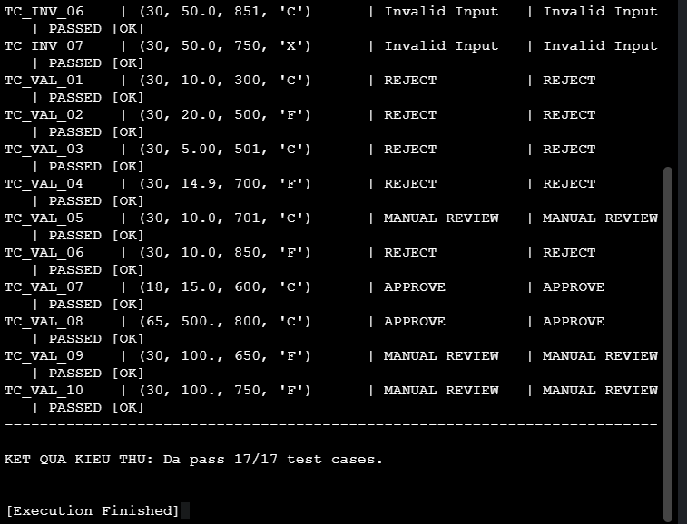
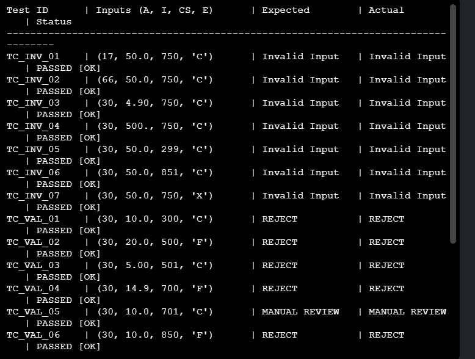

# Mô-đun Phê Duyệt Khoản Vay Cá Nhân - CS2045 Bank

Dự án triển khai mô-đun phần mềm tự động quyết định phê duyệt khoản vay dựa trên các tham số đầu vào: `age`, `income`, `credit_score`, và `employment`.

## Kỹ thuật Kiểm thử Đã Áp Dụng
* **Phân hoạch tương đương (EP)** & **Phân tích giá trị biên (BVA)** cho dữ liệu đầu vào.
* **Bảng quyết định (Decision Table)** tối ưu hóa để bao phủ các kịch bản nghiệp vụ.

## Cách Chạy Chương Trình C++

```bash
g++ -std=c++11 main.cpp -o loan_test
./loan_test
```
## Chứng minh kết quả kiểm thử (Test Results)

Dưới đây là minh chứng chương trình đã vượt qua 100% các ca kiểm thử (17/17 Test Cases) bao gồm cả phân hoạch lỗi biên và bảng quyết định nghiệp vụ:



